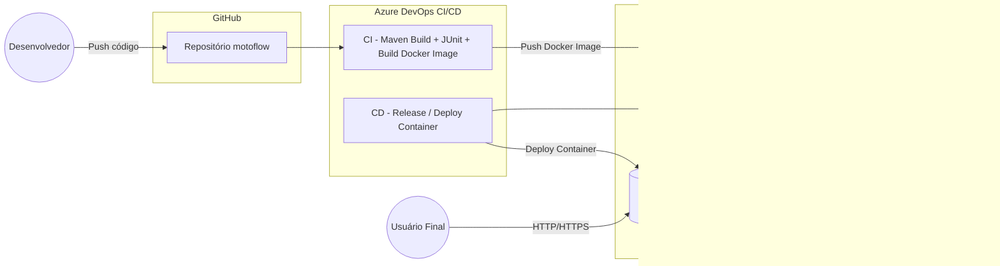

## Editando para teste.

```mermaid
flowchart LR
 
USER((Usuário Final))
DEV((Desenvolvedor))
 
subgraph GitHub["GitHub"]
  REPO[Repositório motoflow]
end
 
subgraph DevOps["Azure DevOps CI/CD"]
  CI[CI - Maven Build + JUnit + Build Docker Image]
  CD[CD - Release / Deploy Container]
end
 
subgraph Azure["Azure Cloud - rg-motoflow"]
  ACR[(ACR - acrrm558301)]
  ACI[(ACI - acirm558301)]
  DB[(PostgreSQL Flexible Server<br/>motoflow)]
  WEBAPP[(Web App - acrwebapprm558301)]
end
 
DEV -->|Push código| REPO
REPO --> CI
CI -->|Push Docker Image| ACR
 
CD -->|Deploy Container| ACI
CD -->|Deploy Container| WEBAPP
ACR <--> ACI
 
USER -->|HTTP/HTTPS| WEBAPP
 
 
WEBAPP -->|API JDBC + SSL| DB
 
```
